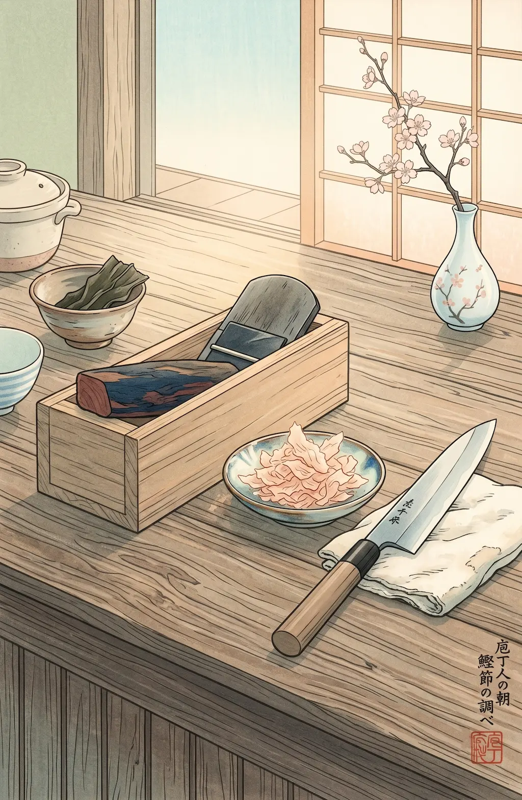

<div align="center">
    
    <br>
    <br>
    <p>
Libraries and templates for Nix Flake-based projects.

I tend to set up my projects with the same workflows again and again. This
repository assembles the things I always find useful.

I hope that you will enjoy it. </p>

</div>

## Inventory

### Libraries

Katsuobushi libraries are broken out by domain and can be used a la carte:

| Library                              | Published as   | Description                                                                        |
| ------------------------------------ | -------------- | ---------------------------------------------------------------------------------- |
| [`rust`](lib/rust/README.md)         | `lib.rust`     | Convenience wrapper over [Crane] to reduce boilerplate in Rust project derivations |
| [`markdown`](lib/markdown/README.md) | `lib.markdown` | Formatting and lint for Markdown documentation (via [Prettier])                    |
| [`sandbox`](lib/sandbox/README.md)   | `lib.sandbox`  | Ephemeral, project-specific, VM-sandboxed workspaces (Linux-only, via [`qemu`])    |
| [`project`](lib/project/README.md)   | `lib.project`  | File-backed project backlog board (Obsidian Kanban) with sandboxed agent dispatch  |
| [`menu`](lib/menu/README.md)         | overlay        | Generate a colorful and useful command menu for a project's devshell               |

The first four are flake outputs you call directly. `menu` is different: it
arrives through this flake's **overlay** as `pkgs.katsuobushi`, not as a
`lib.menu` output.

### Templates

Several Nix Flake templates are available for quick project scaffolding:

| Template  | Description                                          | Usage                                                |
| --------- | ---------------------------------------------------- | ---------------------------------------------------- |
| `default` | Basic flake with a fancy menu                        | `nix flake init -t github:cdata/katsuobushi`         |
| `sandbox` | General flake with a menu and pre-configured sandbox | `nix flake init -t github:cdata/katsuobushi#sandbox` |
| `rust`    | Flake for Rust projects w/ maximum umami             | `nix flake init -t github:cdata/katsuobushi#rust`    |

### Skills

Skills help agents to use Katsuobushi libraries with minimal additional
instructions:

| Skill                   | Description                                                                |
| ----------------------- | -------------------------------------------------------------------------- |
| `sandbox`               | Configuration and usage of the `sandbox` Nix library                       |
| `project`               | Managing a backlog on the `project` board — cards, lifecycle, and priority |
| `project-orchestration` | Driving a `project` board with sandboxed agents (dispatch + peer review)   |
| `design`                | Author a Project Design Document (PDD) into `project/design/`              |
| `plan`                  | Turn an accepted PDD into board cards                                      |
| `implement`             | Drive a swarm of sandboxes to build one label thread to `ready`            |

Track the [plugin marketplace][plugins] with your agent harness and install the
`katsuobushi` plugin to get started e.g.,

```text
/plugin marketplace add cdata/katsuobushi
/plugin install katsuobushi@katsuobushi
```

[Crane]: https://crane.dev
[Prettier]: https://prettier.io
[`qemu`]: https://www.qemu.org
[plugins]: https://docs.claude.com/en/docs/claude-code/plugins
